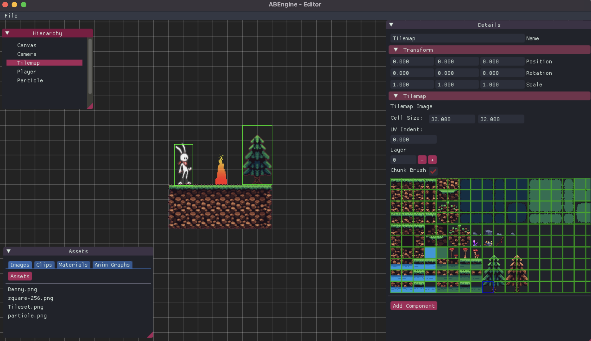

# ABEngine
ABEngine is a cross-platform 2D game engine. It is designed to be code-oriented but includes an Editor to simplify some development aspects.

## Features

ABEngine aims to provide all the essential features for developing a 2D game from start to finish.

* Multi-platform: Windows / Mac / Linux (untested)
* Core
  * Entity-Component-System
  * Physics via Box2D
* 2D Graphics
  * Spritesheets
  * Tilemaps
  * Particles
  * Lights
  * Batching
* Audio
  * WAV playback
* UI
  * Texts
  * Buttons
  * Sliders
* Input
  * Keyboard / Mouse
  * Gamepad
* Editor
  * Scene creation
  * Particle/Tilemap editors
  * Asset management

 
> **Warning** - This is a hobby project and hasn't been tested with real-life cases.
>   All listed features are going through constant improvements and they are not finalized.

## License

ABEditor is licensed under the GPL-3.0 License. Other ABEngine libraries are licensed under the LGPL-3.0 License. See `LICENSE` and `LICENSE-LIBS` for more information.

## Acknowledgments

ABEngine depends on multiple great libraries.
* [Veldrid](https://github.com/mellinoe/veldrid)
* [SDL](https://github.com/libsdl-org/SDL) / [SDL2-CS](https://github.com/flibitijibibo/SDL2-CS)
* [Dear ImGui](https://github.com/ocornut/imgui) / [ImGui.NET](https://github.com/mellinoe/ImGui.NET)
* [SimpleECS](https://github.com/PeteyChan/SimpleECS)
* [Crc32.NET](https://github.com/force-net/Crc32.NET)
